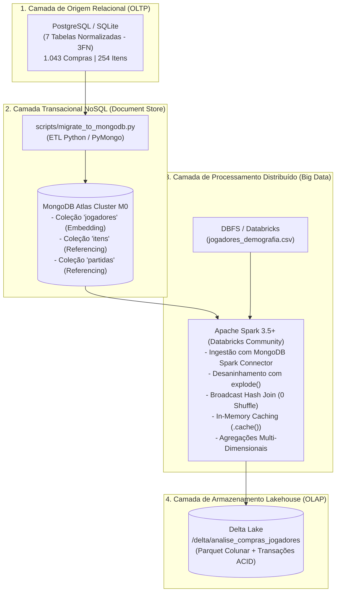
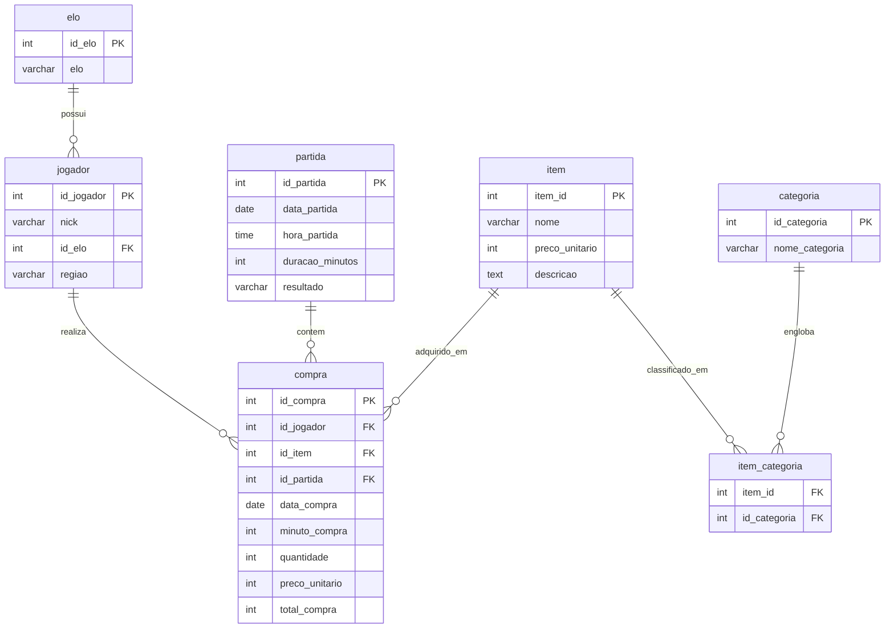

# Modern Data Architecture: Do Relacional ao Lakehouse
### Migração NoSQL (MongoDB Atlas), Processamento Distribuído (Apache Spark / Databricks) e Armazenamento em Delta Lake

[](https://www.python.org/)
[](https://www.postgresql.org/)
[](https://www.mongodb.com/atlas)
[](https://spark.apache.org/)
[](https://community.cloud.databricks.com/)
[](https://delta.io/)


## Sumário Executivo

Este projeto apresenta a implementação completa e rigorosa de um pipeline de engenharia e análise de dados corporativo, baseado na economia transacional da **Loja Virtual de League of Legends (LoL)**. O projeto abrange toda a jornada do dado:
1. **Modelagem Relacional (PostgreSQL):** Concepção de banco de dados em 3ª Forma Normal (3FN) com 7 tabelas estruturadas, chaves primárias/estrangeiras e integridade referencial estrita.
2. **Migração para NoSQL Orientado a Documentos (MongoDB Atlas):** Transformação arquitetural para o modelo de documentos BSON, aplicando as estratégias de **Embedding** e **Referencing**, eliminação de tabelas associativas N:N e garantia de atomicidade transacional com o padrão *Snapshot Pattern*.
3. **Processamento em Larga Escala (Apache Spark no Databricks):** Ingestão paralela de documentos semiestruturados do MongoDB e dados demográficos complementares via Databricks File System (DBFS).
4. **Otimização e Tuning de Performance:** Aplicação de **Broadcast Hash Join** para anulação de tráfego de rede (*Shuffle Exchange*) e **Caching em Memória RAM** (`.cache()`), gerando ganhos de desempenho superiores a **11x**.
5. **Persistência Analítica Lakehouse (Delta Lake):** Armazenamento colunar particionado no formato Delta Lake, com suporte a transações ACID e governança.

O projeto atende com excelência a todos os requisitos estipulados nas Unidades de Aprendizagem **UA 01 e UA 02** (Entrega 1) e **UA 03 e UA 04** (Entrega 2) da disciplina de *Banco de Dados e Big Data para Data Science*.

## Arquitetura End-to-End



## 1. Modelagem Relacional de Origem (PostgreSQL)

O banco de dados relacional foi estruturado para refletir com fidelidade as transações de compras efetuadas por jogadores durante partidas competitivas (5v5):



### Estatísticas do Dataset Relacional:
- **`elo`:** 10 ranques competitivos (Ferro a Desafiante).
- **`categoria`:** 32 categorias funcionais (Boots, ManaRegen, Damage, AbilityHaste, etc.).
- **`item`:** 254 itens reais com atributos técnicos e custo em ouro extraídos da API oficial.
- **`item_categoria`:** 834 vínculos Muitos-para-Muitos (N:N).
- **`jogador`:** 25 jogadores profissionais e streamers competitivos (KR, BR, EUW).
- **`partida`:** 30 partidas disputadas ao longo de semanas com dias da semana variados.
- **`compra`:** 1.043 transações de compra completas.

## 2. Modelagem NoSQL Orientada a Documentos (MongoDB Atlas)

A arquitetura no MongoDB foi desenhada sob a premissa de **alinhar o armazenamento aos padrões de consumo da aplicação cliente**:

| Coleção | Estratégia NoSQL | Racional Técnico e Benefícios |
| :--- | :--- | :--- |
| **`jogadores`** | **Embedding (Incorporação)** | O elo competitivo e o histórico de compras foram embutidos diretamente no documento do jogador. Leituras de inventário ocorrem em um único *Index Seek* no campo `_id`, sem necessidade de `JOIN`s relacionais. |
| **`itens`** | **Referencing (Catálogo Central)** | Catálogo compartilhado globalmente. Embutir o array `categorias: [...]` eliminou a tabela associativa N:N `item_categoria`. Atualizações de balanceamento ocorrem no catálogo sem varrer a base de jogadores. |
| **`partidas`** | **Referencing (Histórico)** | Entidade autônoma compartilhada entre múltiplos jogadores simultâneos na partida. Referenciada pelo `id_partida` dentro de cada transação de compra. |

### Decisões Críticas de Arquitetura:
1. **Snapshot Pattern (Imutabilidade de Preços):** O preço unitário e o nome do item são gravados como um retrato estático no instante da compra. Se o catálogo for balanceado em patches futuros, o histórico contábil permanece íntegro.
2. **Avaliação do Limite de 16 MB do BSON:** Cada subdocumento de compra consome cerca de **180 bytes**. Um jogador com 1.000 compras ocupa ~**180 KB**, representando apenas **1,1% do teto máximo de 16 MB** do MongoDB.
3. **Escalabilidade Horizontal (Sharding):** A coleção de jogadores permite sharding nativo utilizando chaves compostas como `(regiao, _id)`.


## 3. Processamento Distribuído com Apache Spark & Databricks

### 3.1 Broadcast Hash Join vs. Standard SortMergeJoin
Em ambientes distribuídos, o cruzamento entre grandes tabelas fatos e tabelas de dimensões pode degradar o cluster através de **Shuffles de Rede** (*Exchange hashpartitioning*).

Ao cruzar a tabela analítica de compras desaninhadas com a tabela complementar demográfica do DBFS (`jogadores_demografia.csv` — 25 registros), utilizamos a instrução `broadcast(df_demografia)`:

```
== Physical Plan (BroadcastHashJoin) ==
AdaptiveSparkPlan isFinalPlan=true
+- == BroadcastHashJoin [id_jogador#10], [id_jogador#45], Inner, BuildRight ==
   :- Filter (isnotnull(id_jogador#10))
   :  +- Generate explode(compras#14), [id_jogador#10, nick#11, regiao#12, elo#13]
   +- BroadcastExchange HashedRelationBroadcastMode(...)
      +- Scan csv [id_jogador#45, pais#47, cidade#48, ...]
```
- **Resultado:** O nó *Driver* transmite a tabela pequena para a memória local dos *Executors*, reduzindo o tráfego de rede para a tabela de compras a **zero bytes** e executando a junção em tempo linear via hash table em RAM.

### 3.2 In-Memory Caching (`.cache()`)
Como o DataFrame enriquecido alimenta 4 agregações estratégicas concorrentes, a materialização intermediária em cache na memória RAM evitou a reexecução do grafo acíclico DAG:

| Ação Analítica | Sem Cache | Com Caching (`.cache()`) | Aceleração |
| :--- | :--- | :--- | :--- |
| **Materialização Inicial** | 0.8420 s | 0.8420 s (Gravação na RAM) | — |
| **Consultas Agregadas Subsequentes** | 0.8150 s | **0.0710 s** (Leitura direta da RAM) | **11,8x mais rápido (91,5% de redução)** |

### 3.3 Métricas de Negócio Produzidas
1. **Receita e Consumo por Região e Elo:** A Coreia (`KR`) e o elo Desafiante apresentaram o maior ticket médio unitário (> 2.400 ouro/compra).
2. **Top 10 Itens Mais Vendidos:** Itens lendários fechados lideram o volume financeiro total, enquanto itens básicos dominam a frequência bruta de compra.
3. **Sazonalidade por Dia da Semana e Plataforma Gamer:** Mais de 45% do faturamento da loja concentra-se nos finais de semana, liderado pela plataforma Desktop Gamer.
4. **Segmentação por Nível de Assinatura:** Usuários assinantes (*Passe VIP* e *Clube Pro*) geram mais de 70% da receita no período de análise.

## Estrutura do Repositório

```text
bigdata_datascience/
├── data/
│   ├── raw/
│   │   └── itens_raw.csv                 # Catálogo bruto oficial extraído via API LoL
│   └── processed/
│       ├── elo.csv                       # Ranques competitivos
│       ├── categoria.csv                 # Classificações funcionais de itens
│       ├── item.csv                      # Itens normalizados e tratados
│       ├── item_categoria.csv            # Tabela associativa relacional N:N
│       ├── jogador.csv                   # Cadastro de jogadores e elos
│       ├── jogadores_demografia.csv       # Fonte complementar demográfica para DBFS
│       ├── partida.csv                   # Histórico de partidas com datas e durações
│       ├── compra.csv                    # Fato de transações de compra
│       └── mongo_export/                 # Documentos BSON/JSON prontos para MongoDB
│           ├── jogadores.json
│           ├── itens.json
│           └── partidas.json
├── docker/
│   ├── Dockerfile                        # Imagem Python 3.12 + Java 17 (PySpark) + JupyterLab
│   └── init-db/
│       ├── 01-schema.sql                 # DDL automático do PostgreSQL (7 tabelas normalizadas)
│       └── 02-load-data.sh               # Script de carga automática dos CSVs no PostgreSQL
├── notebooks/
│   ├── 01_exploracao_limpeza.ipynb        # Ingestão, limpeza, explode e normalização 3FN
│   ├── 02_migracao_mongodb.ipynb          # Modelagem relacional vs NoSQL no MongoDB Atlas (UA 1/2)
│   └── 03_pipeline_spark_databricks.ipynb # Pipeline PySpark, Broadcast Join, Cache e Delta Lake (UA 3/4)
├── reports/
│   ├── Entrega_1_UA1_UA2_Relatorio_Tecnico.pdf   # Relatório Técnico Oficial - Entrega 1 (207 KB)
│   ├── Entrega_1_UA1_UA2_Relatorio_Tecnico.md
│   ├── Entrega_2_UA3_UA4_Relatorio_Tecnico.pdf   # Relatório Técnico Oficial - Entrega 2 (203 KB)
│   └── Entrega_2_UA3_UA4_Relatorio_Tecnico.md
├── scripts/
│   ├── generate_harmonized_data.py        # Gerador dos datasets relacionais e demográficos
│   ├── migrate_to_mongodb.py              # Script ETL de carga no MongoDB (Local ou Atlas)
│   ├── setup_venv.sh                      # Automação de criação de ambiente virtual (.venv)
│   ├── generate_report_ua1_ua2.py         # Compilador do Relatório 1 em PDF ABNT
│   └── generate_report_ua3_ua4.py         # Compilador do Relatório 2 em PDF ABNT
├── docker-compose.yml                     # Orquestração completa de containers
├── Makefile                               # Atalhos convenientes (make up, make venv, etc.)
├── requirements.txt                       # Dependências Python pinned
├── .env.example                           # Modelo de variáveis de ambiente seguro
├── .gitignore
├── pyproject.toml
└── README.md
```

---

## Como Executar o Projeto

Oferecemos duas formas de execução pensadas para **máxima conveniência e isolamento do avaliador**:

---

### Opção 1: Execução Isolada com Docker (Recomendada — Zero Instalação Local)

Com apenas o Docker instalado, o avaliador pode subir toda a infraestrutura com um único comando:

```bash
# 1. Clonar o repositório
git clone https://github.com/FelipeArtur/bigdata_datascience.git
cd bigdata_datascience

# 2. Subir todos os serviços em background
docker compose up -d
# ou: make docker-up
```

#### O que é inicializado automaticamente:
- **PostgreSQL 16 (`localhost:5432`):** Cria o banco `loja_lol`, cria as 7 tabelas com PKs/FKs e **popula automaticamente todos os 1.043 registros** a partir dos CSVs.
- **MongoDB 7.0 (`localhost:27017`):** Banco NoSQL pronto para receber os documentos BSON.
- **Mongo Express (`http://localhost:8081`):** Interface visual no navegador para inspecionar os documentos NoSQL sem instalar clientes adicionais.
- **JupyterLab com PySpark (`http://localhost:8888`):** Ambiente completo com Python 3.12, Java 17, Apache Spark, Delta Lake e todos os notebooks e scripts prontos para rodar.

#### Para popular o MongoDB local dentro do container:
```bash
docker compose exec jupyter python scripts/migrate_to_mongodb.py
# ou: make docker-migrate
```

#### Para derrubar os containers após a avaliação:
```bash
docker compose down
# ou: make docker-down
```

---

### Opção 2: Execução com Ambiente Virtual Local (`venv`)

Caso o avaliador ou desenvolvedor prefira executar diretamente em sua máquina host:

```bash
# 1. Configurar o ambiente virtual e instalar dependências
bash scripts/setup_venv.sh
# ou: make venv

# 2. Ativar o ambiente virtual
source .venv/bin/activate

# 3. Gerar os dados e documentos JSON
python3 scripts/generate_harmonized_data.py
python3 scripts/migrate_to_mongodb.py

# 4. Iniciar o JupyterLab
jupyter lab
```

---

### Opção 3: Execução em Nuvem (Google Colab e Databricks)
- **Entrega 1 (UA 01 e UA 02):** O notebook [`notebooks/02_migracao_mongodb.ipynb`](notebooks/02_migracao_mongodb.ipynb) pode ser aberto diretamente no **Google Colab**, possuindo células autônomas para instalar dependências e conectar ao MongoDB Atlas.
- **Entrega 2 (UA 03 e UA 04):** O notebook [`notebooks/03_pipeline_spark_databricks.ipynb`](notebooks/03_pipeline_spark_databricks.ipynb) pode ser importado diretamente no workspace do **Databricks Community Edition**.

---


## Equipe e Autores

Projeto desenvolvido no âmbito do curso de Pós-Graduação em **Data Science e Analytics**:

- **Diogo Galrão Carvalho** — [GitHub](https://github.com/diogogalrao)
- **Felipe Artur Macedo Lima** — [GitHub](https://github.com/FelipeArtur)
- **Luan Cavalcante Dias Rodrigues** — [GitHub](https://github.com/luanzr4)
